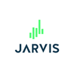

<link rel="stylesheet" type="text/css" media="all" href="src/components/Code/styles/main.scss" />

💎 WHAT WE DO?

We are a well-funded startup building both the technologies and  the user-facing applications of the Jarvis Network, a set of protocols on Ethereum which universalize the access to any financial markets and assets (1), and o uberize brokerage (2).

 

(1) Our protocols allow anyone with Internet to use stablecoins as collateral to trustlessly open long and short leveraged position or to create synthetic assets on any financial market.

 (2) Our protocols allow anyone to become broker, hedge their exposure and earn fees, by supplying stablecoin in liquidity pools agasint which users are trading.

 

*We are building a critical piece of the DeFi infrastructure.*

 

 

🧠 YOU ROLE…

You will be crucial to our effort to solve issue to make our protocol more decentralized, trustless, non-custodial, open and powerful.

 

•             Research and development on oracle, distributed data storage, state channel and other scalling solutions, private key management, etc.

•             Developing/maintaining/upgrading sets of smartcontracts

•             Play with/combine DeFi protocols and integrate at a smartcontract level

•             Increase decentralization and trustlessness of our protocols

•             Participate in R&D, identify issues and evaluate implications of ideas or solutions 

•             Participate in code reviews and ensure exceptional code quality

 

 

 

✅ YOU ARE A VERY PRODUCTIVE DEV WITH…

•             1+ year(s) of experience with smartcontract and Blockchain development

•             knowledge about DeFi (ideally you are a DeFi user)

•             3+ years of experience with any of: C++/C#/F#/D/Rust/Dart/Kotlin/Scala/Elm/ES6/JavaScript/TypeScript

•             general programming expertise - data structures, computer architecture, operating systems, web architecture, security

•             proficiency with Git and familiarity VCS workflows such as git flow 

•             familiarity with async programming: Future/Promise/Task, async/await, RX (Reactive Extensions), Redux(-Thunk/Saga)

•             familiarity of functional programming principles 

 

 

 

🤑 ABOUT THE JOB OFFER...

•             Remote, or in Sofia, Bulgaria, in the perfect city-center and in the coolest office ever

•             Be part of the core-team of a, and a long-term career

•             Flexible working-time and home-office

•             Competitive salary, bonuses and equity-token

•             Cool dog-friendly office

Cosy atmosphere, team building, video games, drone, robot, barbecue, ping-pong  
 

[<button class="btn-mdx">Apply</button>](https://github.com/user/repository/subscription)
